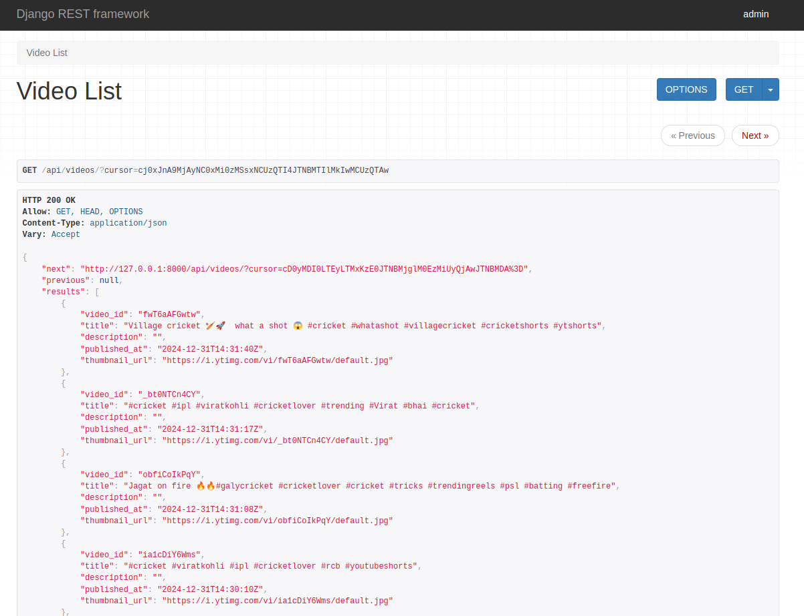
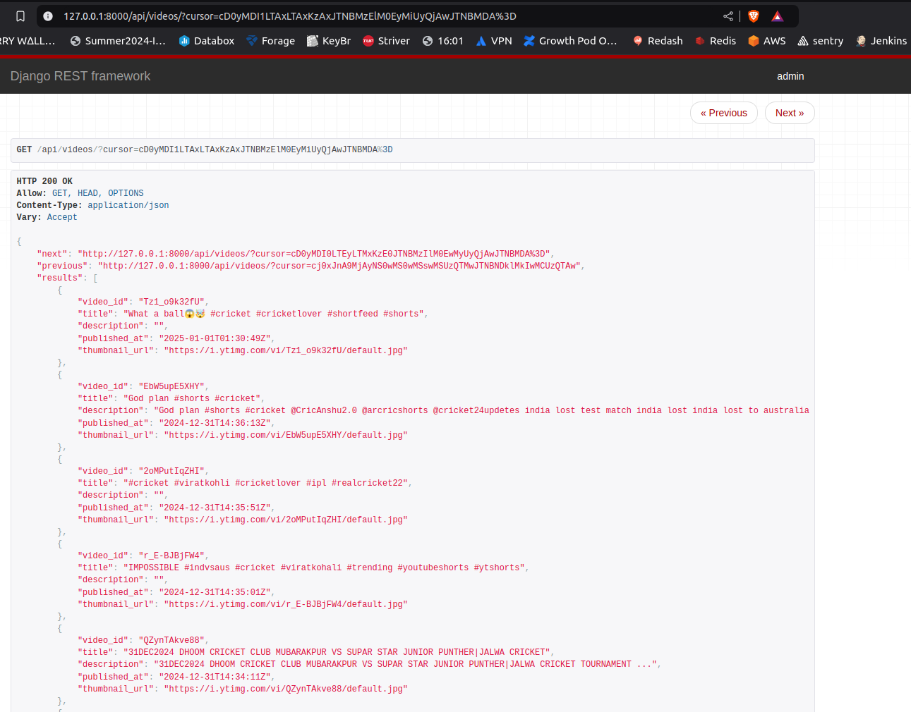

# Fampay Hiring Assignment Submission
First Commit - 16 hours ago before documenting, 17 hours ago after documentation added

## Project Goal

To make an API to fetch the latest videos sorted in reverse chronological order of their publishing date-time from YouTube for a given tag/search query in a paginated response.

## Basic Requirements:

- Server should call the YouTube API continuously in the background (async) with some interval (say 10 seconds) for fetching the latest videos for a predefined search query and should store the data of videos (specifically these fields - Video title, description, publishing datetime, thumbnails URLs, and any other fields you require) in a database with proper indexes.
- A GET API which returns the stored video data in a paginated response sorted in descending order of published datetime.
- It should be scalable and optimised.

## Bonus Points:

- Add support for supplying multiple API keys so that if quota is exhausted on one, it automatically uses the next available key.
- Make a dashboard to view the stored videos with filters and sorting options (optional).

**References:**
- YouTube data v3 API: [Getting Started](https://developers.google.com/youtube/v3/getting-started)  
- Search API Reference: [Search/List](https://developers.google.com/youtube/v3/docs/search/list)

---

## How to Run the Project

1. **Clone the Repository**
   ```bash
   git clone https://github.com/Quinos2003/youtube-video-fetcher.git
   cd youtube-video-fetcher
   ```
2. **Build and Run Docker Containers**
   ```bash
   docker-compose up --build
   ```
   The app will run at http://localhost:8000.
   The PostgreSQL database will be set up automatically.
3. **Testing Pagination**
   To fetch video data in paginated responses:
   ```bash
   curl -X GET "http://localhost:8000/api/videos/" | jq
   ```
   Use the next cursor from the response to fetch subsequent pages.

4. **After Running Docker**
   Add API Keys to the Database
   Open the Django admin interface:
   ```bash
   http://localhost:8000/admin/
   ```
   Log in using the superuser credentials.
   Navigate to the "API Keys" section and add your YouTube Data API keys.
   
## Features

### 1. Continuous Video Fetching
- A background task fetches videos from YouTube's Data API every 10 seconds for the predefined search query.

### 2. Cursor-Based Pagination
- Efficient pagination using cursors for stable data retrieval.

### 3. API Key Management
- Supports multiple API keys to handle quota exhaustion.
- Automatically switches to the next available key when the current one exceeds the quota.

### 4. Admin Dashboard
- A web-based interface for viewing, filtering, and sorting stored videos.
- Developed using Django's built-in admin functionality.

---

## Design Choices

### **Database (PostgreSQL)**
- Chosen for its reliability and ability to handle large datasets efficiently.
- Optimized with indexes for querying video data.

### **Backend Framework (Django)**
- DRF simplifies the implementation of RESTful APIs.
- Django ORM ensures easy database integration and migrations.

### **Deployment (Dockerized)**
- The app runs inside isolated containers for portability and easy scaling.
- NGINX is used as a reverse proxy for load balancing across replicas.

### **Scalability & Load Balancing (Replica instances & NGINX)**
- Docker Compose supports scaling `web` services to multiple instances with the `replicas` parameter.
- NGINX balances the load between these replicas.

---

### Screenshots and Recordings:

1. **Implementation of Cursor-Based Pagination**  
   Demonstrates the efficient pagination mechanism with cursors.  
   
   

2. **API_FETCHING_RESULTS_EVERY_10_SECOND.webm**  
   Screen recording showcasing the background task fetching video data every 10 seconds.  
   

3. **API_KEY_ADDITION_SUPPORT_DASHBOARD.mp4**  
   Demonstrates API key management and the admin dashboard features.  
   

### Project Directory Structure:

1. **Root Directory**  
   - **manage.py**: Entry point for the Django project.
   - **nginx.conf**: Configuration file for Nginx reverse proxy.
   - **requirements.txt**: Python dependencies for the project.
   - **Dockerfile**: Docker build instructions.
   - **docker-compose.yml**: Configuration for Docker Compose.
   - **README.md**: Documentation for the project.

2. **App Directory (`videos/`)**  
   - **serializers.py**: Defines serializers for API responses.
   - **models.py**: Contains database models for videos and API keys.
   - **urls.py**: URL routes for the `videos` app.
   - **views.py**: Implements API logic and endpoints.
   - **admin.py**: Configures admin dashboard for API key management.
   - **tasks.py**: Background tasks for periodic data fetching.
   - **tests.py**: Unit tests for the `videos` app.
   - **migrations/**: Contains migration files for database schema changes.

3. **Django Project Directory (`youtube_video_fetcher/`)**  
   - **settings.py**: Django project configuration.
   - **urls.py**: Global URL configurations for the project.
   - **asgi.py**: ASGI application for asynchronous handling.
   - **wsgi.py**: WSGI application for server communication.
